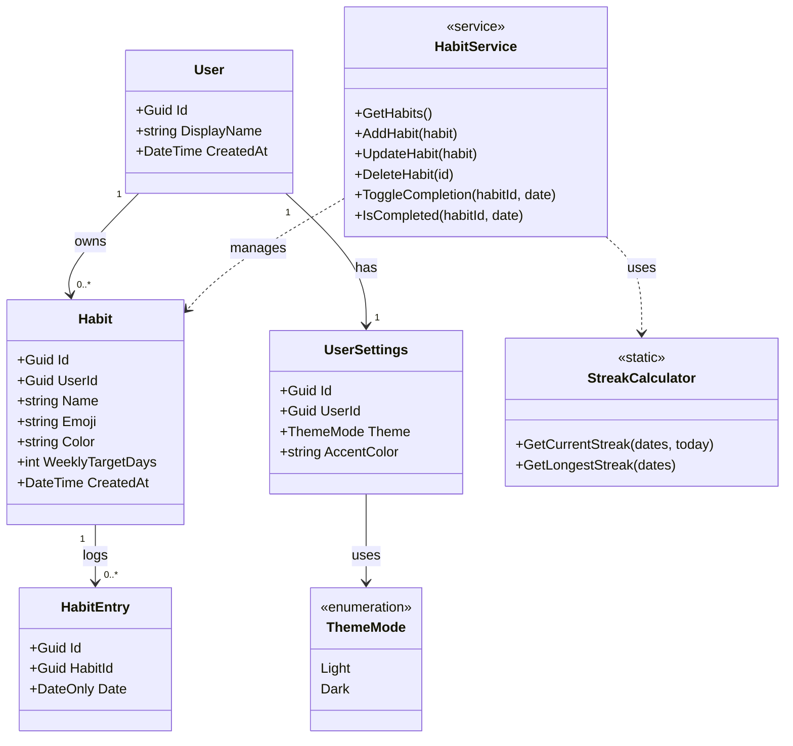

# Habitually Class Diagram

```mermaid
classDiagram
    class User {
        +Guid Id
        +string DisplayName
        +DateTime CreatedAt
    }
    class UserSettings {
        +Guid Id
        +Guid UserId
        +ThemeMode Theme
        +string AccentColor
    }
    class Habit {
        +Guid Id
        +Guid UserId
        +string Name
        +string Emoji
        +string Color
        +int WeeklyTargetDays
        +DateTime CreatedAt
    }
    class HabitEntry {
        +Guid Id
        +Guid HabitId
        +DateOnly Date
    }
    class ThemeMode {
        <<enumeration>>
        Light
        Dark
    }
    class HabitService {
        <<service>>
        +GetHabits()
        +AddHabit(habit)
        +UpdateHabit(habit)
        +DeleteHabit(id)
        +ToggleCompletion(habitId, date)
        +IsCompleted(habitId, date)
    }
    class StreakCalculator {
        <<static>>
        +GetCurrentStreak(dates, today)
        +GetLongestStreak(dates)
    }

    User "1" --> "0..*" Habit : owns
    User "1" --> "1" UserSettings : has
    Habit "1" --> "0..*" HabitEntry : logs
    UserSettings --> ThemeMode : uses
    HabitService ..> Habit : manages
    HabitService ..> StreakCalculator : uses
```